# Trabajo Practico nº 1 - Parte I - Conguración y Análisis de tráco IPv4/IPv6

**Institucion: UNC - Facultad de Ciencias Exactas, Físicas y Naturales**  
**Materia: Redes de Computadoras**

**Profesores**
- Facundo Oliva Cuneo (Teorico).
- Santiago Martín Henn (Laboratorios).

**Fecha: 27-03-2025** 

---
## Nombre del grupo: Sin Latencia Team

## Nombres de los integrantes
- Efrain G. Veliz S.
- Elio N. Ludueña
- Juan I. Sassi 
- Franco L. Cirrincione

## Información de los autores
- efrain.veliz@mi.unc.edu.ar
- nicoluduena@mi.unc.edu.ar
- juan.sassi@mi.unc.edu.ar
- francocirrincione@mi.unc.edu.ar
---

## Resumen
En el presente trabajo se aborda la configuración de un entorno de red con soporte dual stack, implementando los protocolos IPv4 e IPv6 mediante el uso de emuladores o simuladores de redes. Se analizan las diferencias en la gestión del tráfico de red, incluyendo el comportamiento de protocolos clave como ARP (Address Resolution Protocol) en IPv4, NDP (Neighbor Discovery Protocol) en IPv6 e ICMP (Internet Control Message Protocol) en ambos casos. Además, se implementa la asignación dinámica de direcciones utilizando el protocolo DHCP, evaluando su funcionamiento tanto en IPv4 (DHCPv4) como en IPv6 (DHCPv6). A lo largo del estudio, se examinan las interacciones entre estos protocolos y su impacto en la conectividad y eficiencia de la red.

**Palabras clave**: Dual Stack IPv4, IPv6, ARP (Address Resolution Protocol), NDP (Neighbor Discovery Protocol), ICMP (Internet Control Message Protocol), DHCP (Dynamic Host Configuration Protocol), DHCPv4, DHCPv6, Emulador de red, Simulador de red, Tráfico de red, Direcciones IP, Subnetting, Router, Switch, Configuración de red, Topología de red, Paquetes de datos, Latencia, Seguridad en redes.

---

## Introducción
En el contexto actual de las redes de computadoras, la coexistencia de los protocolos **IPv4** e **IPv6** es una necesidad fundamental para garantizar la interoperabilidad y la transición entre ambas tecnologías. Este trabajo práctico tiene como objetivo explorar la **configuración de un entorno de red dual stack**, utilizando herramientas de **simulación y emulación** para analizar el tráfico de red y el comportamiento de diversos protocolos.  

A lo largo del desarrollo del trabajo, se estudiará el funcionamiento de **ARP** (*Address Resolution Protocol*) en **IPv4** y **NDP** (*Neighbor Discovery Protocol*) en **IPv6**, así como la comunicación a través de **ICMP** (*Internet Control Message Protocol*). Además, se implementará la **asignación dinámica de direcciones** mediante el uso de **DHCPv4** y **DHCPv6**, evaluando su impacto en la configuración y administración de redes.  

Para la implementación y análisis, se utilizarán herramientas como **GNS3**, **Packet Tracer** y **CORE**, que permiten la creación y prueba de escenarios de red de manera controlada. Finalmente, se realizarán pruebas de conectividad y capturas de tráfico para examinar el intercambio de información entre los dispositivos, comprendiendo mejor el proceso de resolución de direcciones y la gestión de los paquetes de datos en un entorno de **red dual stack**.  

---

### Para luego realizar las actividades, se planteo la siguiente red y Tabla de asignación de direcciones
<br>
<p align="center">
    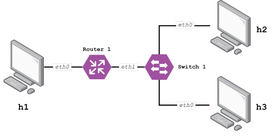
</p>
<p align="center">Figura 1: Red de estudio.</p>
<br>
<br>
<p align="center">
    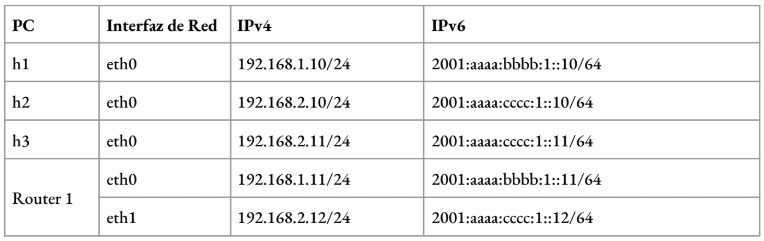
</p>
<p align="center">Figura 2: Tabla de asignaciones de direcciones.</p>
<br>

---
## Desarrollo

## 1. Marco Teórico - PARTE V - Protocolos de interconexión.
### 1.1) Funciones básicas de los protocolos
Es posible agrupar las funciones de los protocolos dentro de las siguientes categorias:
- **Encapsulamiento:** Casi en todos los protocolos los datos son transferidos en bloques, tambien llamados PDU(Protocol Data Unit).
    Los PDU ademas de los datos, deben tener informacion de control, que se clasifica en:
    - Dirección: del emisor y/o destinatario.
    - Código de deteccion de errores: secuencia de comprobación de la trama para detectar errores.
    - Control de Protocolo: info adicional para implementar los protocolos.
- **Fragmentacion y reensamblado:** La fragmentacion se produce al separar el mensaje en bloques de menor tamaño para su transmisión. Algunas Razones son las siguientes:
    - Tamaño limitado: solo se acepta bloques de un tamaño maximo.
    - Control de errores: mas eficiente la retansmisión del bloque cuando es de menos bits.
    - Acceso más equitativo: trabajando con recursos compartidos, se evita la monopolizacion del medio con tamaño grandes de bloques. 
    - Memoria: El receptor puede reservar memoria temporal mas chica.
    - Paradas técnicas: se puede realizar cada cierto periodo de tiempo controles y operaciones de reinicio/recuperacion.
  **>Desventaja:** 
    - Sobre carga: cuanto más chico el bloque más % de información de control tendra y menos % de Datos.
    - Interrupciones: a mas pequeños los bloques, mas interrupciones generaran.
    - Tiempos: de ser as chicos los bloques mas tiempo llevara procesarlos, y ademas mas trabajo a la hora de reensamblarlos.
- **Control de conexión:** Se requiere un control de conexión en especial cuando se anticipa un intercambio de datos voluminosos.Primeramente se realiza una solicitud de conexión, y en algunos casos una negociacion para establecer la sintaxis, semántica y temporizacion de la comunicación. Posterior al envio de datos y la confirmacion de recepcion, se envia una solicitud de terminacion de la conexion que tambien va acompañada de la aceptacion de la misma.
- **Entrega ordenada:** Es esencial en protocolos orientados a conexión para garantizar que las PDU (unidades de datos de protocolo) lleguen en el mismo orden en que fueron enviadas. Debido a que las PDU pueden tomar distintos caminos en la red, es necesario asignarles números de secuencia únicos y consecutivos para permitir su reordenamiento en el destino. Sin embargo, dado que el número de secuencia es finito y cíclico, debe ser lo suficientemente grande para evitar conflictos, pudiendo incluso requerir el doble del número máximo de PDU en tránsito, como en el ARQ de repetición selectiva.
- **Control de flujo:**  Limita la cantidad o tasa de datos que un emisor puede enviar para evitar la saturación del receptor. El método más simple es parada y espera, donde cada PDU debe ser confirmada antes de enviar la siguiente. Métodos más avanzados, como la ventana deslizante de HDLC, permiten enviar múltiples PDU sin esperar confirmación inmediata. Este control debe aplicarse en distintos niveles, desde la red hasta la aplicación, para evitar sobrecargas en memoria o almacenamiento.
- **Control de errores:** Previene pérdidas y daños en los datos mediante detección y retransmisión. El emisor agrega un código de detección a la PDU, que el receptor verifica al recibirla. Si hay errores, la PDU se descarta y, si no llega un acuse de recibo, se retransmite. Algunos protocolos incluyen corrección de errores para solucionar fallos sin retransmisión. Este control debe aplicarse en varias capas, desde la red hasta el transporte, para garantizar la integridad de los datos en todo el proceso de comunicación.
- **Direccionamiento:** Para garantizar una comunicación eficiente y organizada en redes de datos, definiendolo: 
    - Nivel de direccionamiento: Determina en qué capa del modelo de comunicaciones se asigna una dirección. En la capa de red, cada sistema final o intermedio recibe una dirección única (IP en TCP/IP o NSAP en OSI) utilizada para encaminar datos. En niveles superiores, cada aplicación o usuario se identifica con un puerto (TCP/IP) o SAP (OSI).
    - Alcance del direccionamiento: Se refiere a la aplicabilidad de una dirección. Las direcciones globales son únicas y permiten la comunicación entre cualquier sistema en la red. A nivel de red, las direcciones locales (como MAC en redes IEEE 802) identifican dispositivos dentro de una red específica.
    - Identificadores de conexión: En conexiones orientadas, se usan identificadores temporales en lugar de direcciones globales para reducir la sobrecarga y optimizar el encaminamiento y multiplexación. Ejemplo: en retransmisión de tramas, se usa el DLCI para identificar una conexión.
    - Modo de direccionamiento: Puede ser unidifusión (unicast) para un solo destinatario, difusión (broadcast) para todos en un dominio o multidifusión (multicast) para un subconjunto de destinatarios.
- **Multiplexación:** Permite gestionar múltiples conexiones en un solo sistema o red. Puede realizarse de distintas maneras:
    - Multiplexación en un solo sistema: Varias conexiones pueden compartir una interfaz física, como en la retransmisión de tramas o en conexiones TCP, diferenciadas por números de puerto.
    - Multiplexación entre niveles: Se pueden asignar conexiones de un nivel a otro de dos formas:
        - Multiplexación ascendente (hacia dentro): Múltiples conexiones de un nivel superior comparten una única conexión en un nivel inferior para optimizar recursos.
        - Multiplexación descendente (división): Una conexión de nivel superior se distribuye en varias conexiones inferiores para mejorar fiabilidad, rendimiento o eficiencia.
- **Servicios de transmisión:** Los protocolos pueden ofrecer servicios adicionales para optimizar la comunicación entre entidades,estos dependen del sistema de transmisión y las entidades de niveles inferiores que los soportan. Entre los más comunes están:
    - Prioridad: Permite que ciertos mensajes urgentes, como solicitudes de terminación de conexión, tengan menor retardo. Puede asignarse por tipo de mensaje o conexión.
    - Calidad de servicio (QoS): Garantiza un rendimiento mínimo o limita el retardo máximo para ciertos tipos de datos.
    - Seguridad: Restringe el acceso y protege la información transmitida.
--- 
### 1.2) Principio de la interconexión entre redes.
La interconexión entre redes permite la comunicación entre sistemas de distintas tecnologías, arquitecturas y protocolos. Se basa en los siguientes principios fundamentales:

- **Arquitectura en capas:** Separa las funciones de comunicación en niveles con interfaces bien definidas, como el **modelo OSI** o **TCP/IP**.
- **Independencia de la red física:** Permite conectar diferentes tipos de redes, como Ethernet, Wi-Fi y fibra óptica.
- **Encapsulación y desencapsulación:** Cada capa agrega o elimina información de control a medida que los datos viajan entre el emisor y el receptor.
- **Encaminamiento dinámico:** Utiliza protocolos como **RIP, OSPF y BGP** para determinar las mejores rutas en redes interconectadas.
- **Transparencia de comunicación:** Los usuarios finales no necesitan conocer detalles de la red subyacente.

---
### 1.3) Interconexión entre redes sin conexión.
En las redes sin conexión, los paquetes se transmiten de manera independiente sin establecer un canal de comunicación previo. Características principales:

- **Encaminamiento independiente:** Cada paquete puede tomar una ruta distinta hasta el destino.
- **No se garantiza el orden de entrega:** Los paquetes pueden llegar desordenados y con posibles pérdidas.
- **Reducción de sobrecarga:** Al no requerir establecimiento ni mantenimiento de conexión, la eficiencia mejora en ciertas aplicaciones.

---
### 1.4) El protocolo internet (IPv4).
IPv4 es la versión más utilizada del Protocolo de Internet, con direcciones de **32 bits** y formato **decimal separado por puntos**. Características:

- **Encabezado de 20 bytes**, con campos como **dirección origen, destino, TTL, checksum**.
- **Fragmentación y reensamblado:** Adaptación a distintos MTU.
- **Protocolos complementarios:** ICMP para control de errores, ARP para resolución de direcciones.
- **Limitaciones:** Número finito de direcciones, agotamiento de IP, seguridad limitada.

---
### 1.5) IPv6.
IPv6 fue diseñado para solucionar las limitaciones de IPv4. Características principales:

- **Direcciones de 128 bits**, expresadas en notación hexadecimal.
- **Espacio de direcciones enorme**, con 2¹²⁸ combinaciones posibles.
- **Autoconfiguración:** Permite asignación de direcciones sin DHCP.
- **Encabezado simplificado:** Reduce la carga de procesamiento en routers.
- **Seguridad integrada:** IPSec es obligatorio en IPv6.
- **Multidifusión y anycast:** Métodos avanzados de direccionamiento.
- **Compatibilidad con IPv4:** Técnicas como **túneles y NAT64** facilitan la transición.
---
## 2. Diagrama de red en el software Cisco Packet Tracer.
En este trabajo se ha realizó la construcción del diagrama de red propuesto utilizando el software de simulación Cisco Packet Tracer. Este software permite diseñar, configurar y probar redes de computadoras en un entorno virtual antes de implementarlas físicamente.
El diseño de la red incluye un router que actúa como intermediario entre los dispositivos, un switch que permite la conexión y comunicación entre múltiples dispositivos finales y tres hosts (h1, h2 y h3) que representan computadoras conectadas a la red.

<p align="center">
    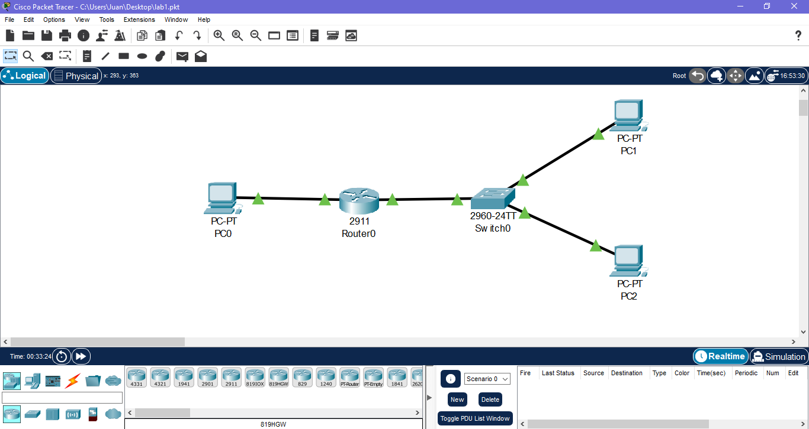
    <p align="center">Figura 3: Diagrama en Cisco Packet Tracer.</p>
</p>

Se configuró un router Cisco con direcciones IPv4 e IPv6, habilitando el enrutamiento entre subredes. Se asignaron IP a las interfaces GigabitEthernet0/0 y 0/1, conectando h1, h2 y h3. Se activó el enrutamiento IPv6 con ipv6 unicast-routing y se habilitaron las interfaces con no shutdown. Luego, se guardó la configuración en NVRAM (copy running-config startup-config). Finalmente, se verificó la asignación de direcciones con show ipv6 interface brief. Esto permitió la comunicación entre los hosts en IPv4 e IPv6.
Aquí la configuración:
```
Router(config-if)#exit
Router(config)#interface gigabit0/1
Router(config-if)#ip address 192.168.2.12 255.255.255.0
Router(config-if)#no shutdown
Router(config-if)#
%LINK-5-CHANGED: Interface GigabitEthernet0/1, changed state to up
%LINEPROTO-5-UPDOWN: Line protocol on Interface GigabitEthernet0/1, changed state to up
Router(config-if)#exit
Router(config)#end
Router#
%SYS-5-CONFIG_I: Configured from console by console
Router#copy running-config startup-config 
Destination filename [startup-config]? 
Building configuration...
[OK]
Router#configure terminal
Enter configuration commands, one per line.  End with CNTL/Z.
Router(config)#ipv6 unicast-routing
Router(config)#interface gigabitEthernet0/0
Router(config-if)#ipv6 address 2001:aaaa:bbbb:1::11/64
Router(config-if)#no shutdown
Router(config-if)#exit
Router(config)#interface gigabitEthernet0/1
Router(config-if)#ipv6 address 2001:aaaa:cccc:1::12/64
Router(config-if)#no shutdown
Router(config-if)#exit
Router(config)#end
Router#
%SYS-5-CONFIG_I: Configured from console by console
Router#copy running-config startup-config
Destination filename [startup-config]? 
Building configuration...
[OK]
Router#show ipv6 interface brief
GigabitEthernet0/0         [up/up]
    FE80::201:C9FF:FE50:301
    2001:AAAA:BBBB:1::11
GigabitEthernet0/1         [up/up]
    FE80::201:C9FF:FE50:302
    2001:AAAA:CCCC:1::12
GigabitEthernet0/2         [administratively down/down]
    unassigned
Vlan1                      [administratively down/down]
    unassigned
Router#
```

## 3. Diferencias entre un simulador y un emulador.
Los emuladores y simuladores son herramientas de prueba en entornos virtuales utilizadas para recrear escenarios de red, con diferencias importantes en funcionamiento y casos de uso.

**Simulador:**  

Modelado abstracto: Recrea el comportamiento de la red a traves de modelos matematicos o logicos, permitiendo analizar el comportamiento teorico de protocolos y topologias sin implementacion en el entorno fisico.
Son particularmente utiles para el estudio de rendimiento, escalabilidad y el impacto de cambios en la red en condiciones controladas, asi como tambien para la investigacion y el diseño, dado que permiten experimentar con distintos escenarios sin los costos asociados a la implementacion fisica ni recrear cada etapa del hardware.

**Emulador:**

Recreación Fiel del Entorno Real: Intenta replicar tanto el hardware como el software de los dispositivos de la red, permitiendo pruebas mucho mas fieles a los sistemas reales.
Se utilizan para probar interoperabilidad, rendimiento y funcionalidad de equipos o servicios en condiciones cercanas a las reales, lo que es un paso clave en la validacion de sistemas antes de su despliegue en produccion. 
Debido a la emulacion de componentes reales en forma fisica, en general requieren mas recursos y son mas complejos que los simuladores, con el beneficio de una presicion mayor.

| Característica | Emuladores | Simuladores |
| ----------- | ----------- | ----------- |
| **Nivel de Abstracción** | Replica entorno real | Modela comportamiento |
| **Precisión** | Alta precisión real | Aproximacion teórica |
| **Recursos** | Más recursos requeridos | Menos recursos |
| **Velocidad** | Lento por emulación | Rápido en simulación |
| **Uso** | Validación y depuración | Análisis y diseño |
| **Tráfico Real** | Soporta tráfico real | Sin tráfico real |
| **Ejemplos** | Mininet, CORE, GNS3 | OMNeT++, Packet Tracer |

## 4. Evaluación de conectividad entre todos los host para IPv4.

Para evaluar la conectividad entre todos los hosts, se envió tres paquetes ICMPv4 utilizando el comando ping en cada uno de ellos. Se verificó que las respuestas fueran exitosas, confirmando la comunicación en la red. Este procedimiento permitió comprobar que el enrutamiento y la configuración de direcciones IPv4 fueran correctos, asegurando que h1, h2 y h3 pudieran intercambiar datos sin interrupciones.

<p align="center">
    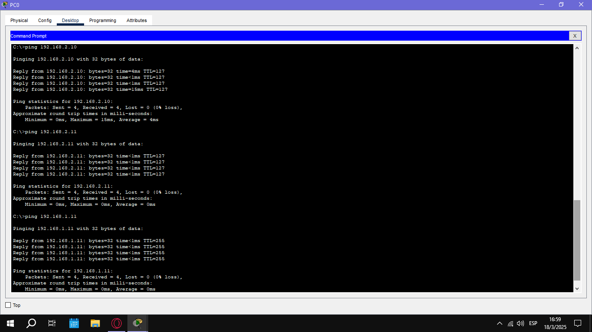
    <p align="center">Figura 4: Pings IPv4 desde h1.</p>
</p>
<p align="center">
    
    <p align="center">Figura 5: Pings IPv4 desde h2.</p>

</p>
<p align="center">
    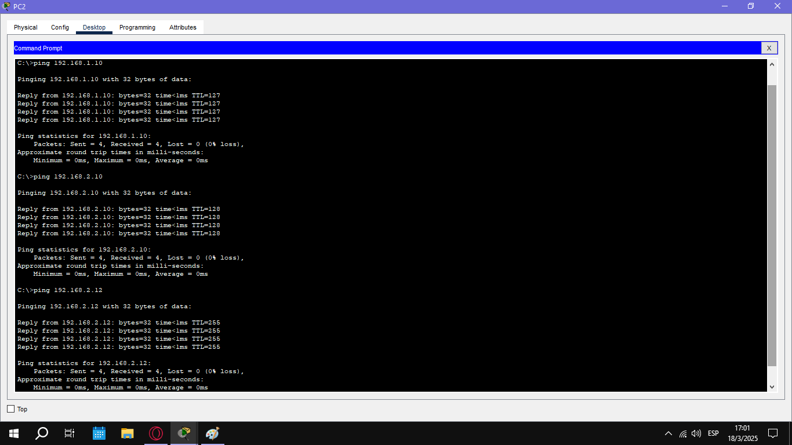
    <p align="center">Figura 6: Pings IPv4 desde h3.</p>

</p>
<p align="center">
    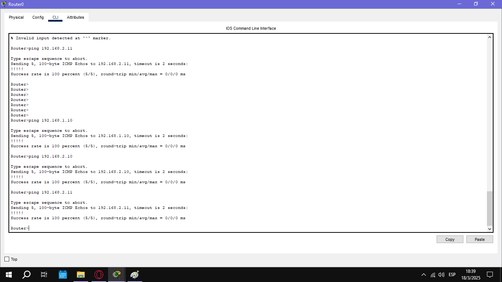
    <p align="center">Figura 7: Ping IPv4 desde R1.</p>

</p>

## 5. Evaluación de conectividad entre todos los host para IPv6.
Para comprobar la conectividad entre todos los hosts, se enviaron tres paquetes ICMPv6 con el comando ping6 desde cada uno. Se verificó que todas las respuestas fueran satisfactorias, asegurando una comunicación estable en la red. Con este proceso, se confirmó que la configuración de IPv6 y el enrutamiento funcionaban correctamente, permitiendo la comunicación sin problemas entre h1, h2 y h3.

<p align="center">
    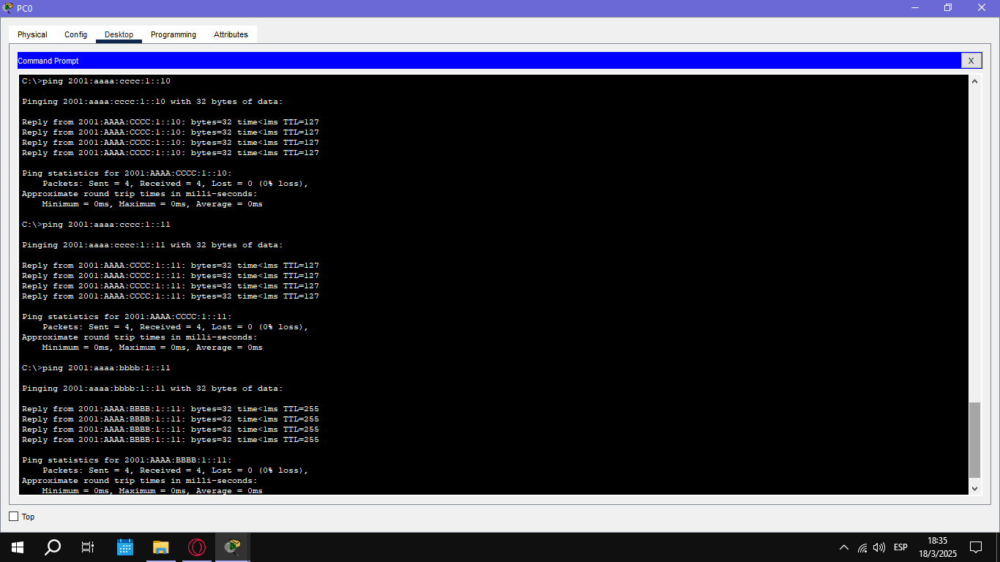
    <p align="center">Figura 8: Pings IPv6 desde h1.</p>
</p>
<p align="center">
    
    <p align="center">Figura 9: Pings IPv6 desde h2.</p>
</p>
<p align="center">
    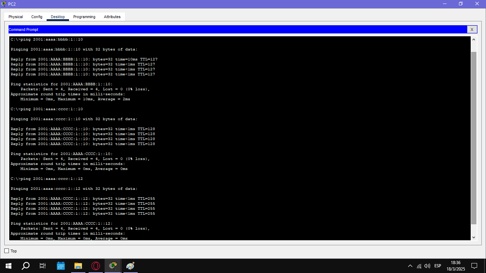
    <p align="center">Figura 10: Pings IPv6 desde h3.</p>
</p>
<p align="center">
    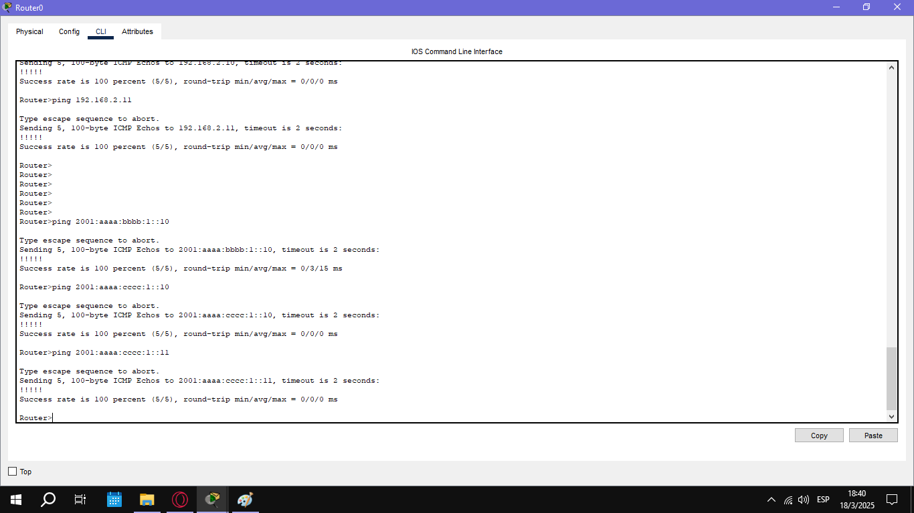
    <p align="center">Figura 11: Pings IPv6 desde R1.</p>
</p>

## 6.  Análisis de Comunicaciones en la Red
  - a) Comunicaciones ARP observadas

Durante la comunicación ICMP, se observan mensajes ARP (Address Resolution Protocol) que son cruciales para la resolución de direcciones IP a direcciones MAC. Este proceso ocurre cuando un dispositivo necesita conocer la dirección MAC de otro dispositivo dentro de la misma red local.
Por ejemplo, cuando PC0 quiere enviar un mensaje a PC1 (que tiene la IP 192.168.2.10), primero envía un ARP Request preguntando "¿Quién tiene 192.168.2.10?". PC1, al recibir este ARP Request, responde con su dirección MAC a través de un ARP Reply. Este mecanismo es fundamental para que los dispositivos se comuniquen dentro de una red.

 - b) Direcciones IP en los datagramas

En los paquetes ICMP (como los generados por los comandos de ping), podemos observar las direcciones IP de origen y destino. En este caso específico, cuando PC0 realiza un ping a PC1, se verá un paquete ICMP donde la dirección de origen es la de PC0 (192.168.1.10) y la dirección de destino es la de PC1 (192.168.2.10). Las direcciones IP son esenciales para la correcta entrega del paquete a través de diferentes redes.

 - c) Determinación de la comunicación entre hosts por parte del enrutador

El enrutador juega un papel crucial en la comunicación entre redes distintas. Para determinar cómo se debe enviar un paquete de un host a otro, el enrutador consulta su tabla de enrutamiento. En este caso, PC0 y PC1 están en redes diferentes (192.168.1.x y 192.168.2.x), por lo que el enrutador debe tomar decisiones basadas en la dirección IP de destino. El enrutador sabe que debe reenviar el tráfico de PC0 hacia la red de PC1, ya que la IP de destino (192.168.2.10) pertenece a la red 192.168.2.x.

 - d) Función del switch y por qué no tiene direcciones IP

El switch es un dispositivo que opera en la capa 2 del modelo OSI, es decir, en la capa de enlace de datos. Su principal función es conectar dispositivos dentro de la misma red local (LAN) y reenviar tramas de datos entre ellos. No necesita direcciones IP porque no está involucrado en la toma de decisiones sobre el enrutamiento de paquetes entre diferentes redes. El switch utiliza las direcciones MAC de los dispositivos para determinar cómo reenviar las tramas de manera eficiente dentro de la misma red.

-  e, f, g) Contenido de las tablas ARP en cada equipo

Las tablas ARP son esenciales para la comunicación dentro de una red local, ya que permiten mapear direcciones IP a direcciones MAC. Al analizar las tablas ARP en los dispositivos, podemos ver qué direcciones MAC conocen los diferentes equipos y cómo estas están asociadas con direcciones IP específicas.
PC0 solo conoce la dirección MAC de su gateway (el router en la dirección 192.168.1.11), ya que no ha tenido necesidad de comunicarse directamente con otros dispositivos en la red.
PC1, por otro lado, conoce tanto la dirección MAC de PC2 (192.168.2.11) como la del router (192.168.2.12), dado que ambas son necesarias para su funcionamiento dentro de la red.
PC2 solo tiene registrada la dirección MAC de PC1 (192.168.2.10) porque se ha comunicado directamente con él, pero aún no ha enviado tráfico hacia fuera de su red, por lo que no tiene la MAC del router registrada.

-  h) Direcciones de broadcast en IPv4

Las direcciones de broadcast en IPv4 son direcciones especiales utilizadas para enviar mensajes a todos los dispositivos dentro de una red local. Por ejemplo, la dirección 192.168.1.255 es una dirección de broadcast en la red 192.168.1.0/24. Esto permite que los paquetes se distribuyan a todos los dispositivos dentro de esa red, lo cual es útil para servicios como ARP y DHCP.

-  i) Direcciones multicast en IPv4

Las direcciones multicast en IPv4 se utilizan para enviar tráfico a un grupo de dispositivos en lugar de a un único dispositivo. Estas direcciones pertenecen al rango 224.0.0.0 a 239.255.255.255. Un ejemplo común de una dirección multicast es 224.0.0.1, que se usa para enviar tráfico a todos los hosts en la red local.

El análisis del tráfico ICMP y las tablas ARP nos muestra cómo los dispositivos dentro de una red se comunican y cómo los mecanismos de ARP y enrutamiento facilitan esta comunicación. Las direcciones IP y MAC, junto con los conceptos de broadcast y multicast, son esenciales para el funcionamiento eficiente de la red.


## 7.
Los tipos de mensajes NDP observados son:
- Neighbor Solicitation (NS): Enviado por el host que quiere conocer la dirección física de otro nodo.
- Neighbor Advertisement (NA): Respuesta al NS, proporcionando la dirección física.
<br>
<p align="center">
    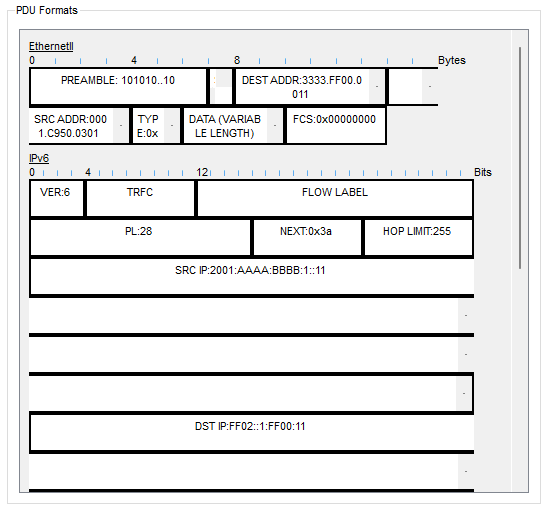
</p>
<p align="center">Figura 12: Datagrama NDP en h1.</p>
<br>
<br>
<p align="center">
    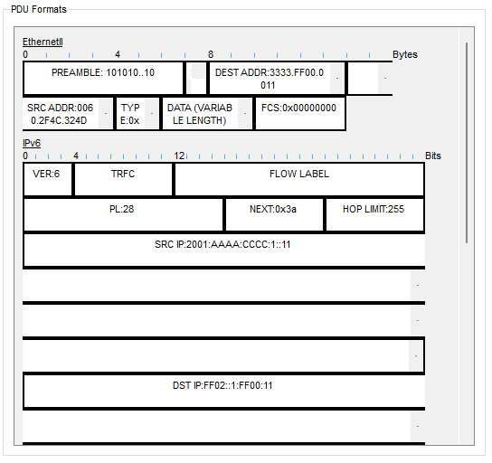
</p>
<p align="center">Figura 13: Datagrama NDP en h3.</p>
<br>
En IPv6 el protocolo NDP (Neighbor Discovery Protocol) reemplaza al ARP usado en IPv4. NDP utiliza mensajes ICMPv6 para descubrir nodos en la red, resolver direcciones de enlace y realizar el resto de sus funciones.

Funciones Principales de NDP:
- Descubrimiento de vecinos: Permite que los nodos descubran la dirección de enlace (MAC) de otros dispositivos en la misma red.
- Detección de direcciones duplicadas (DAD): Verifica que una dirección IPv6 asignada no esté ya en uso.
- Descubrimiento de routers: Los hosts pueden encontrar routers en la red mediante mensajes RS y RA.
- Redirección: Permite a los routers redirigir el tráfico a rutas más óptimas.

En IPv6 no existe el concepto de broadcast, por lo que se utiliza el mecanismo de multicast para reemplazar esa función. En lugar de enviar un paquete a todas las direcciones de la red, se envía a un grupo específico de direcciones multicast, lo que permite dirigir el tráfico solo a los dispositivos interesados en recibirlo, como es el caso de la dirección multicast ff02::1 para todos los nodos en el enlace. Este enfoque optimiza el uso de la red y reduce el tráfico innecesario.

- Direcciones Link-local:
Se utilizan para la comunicación entre dispositivos en el mismo segmento de red. Se configuran automáticamente y tienen el prefijo fe80::/10. Estas direcciones no son ruteables fuera del enlace local y son esenciales para funciones básicas como el descubrimiento de vecinos.
- Direcciones Unique-local:
Las direcciones unique-local son análogas a las direcciones privadas en IPv4. Definidas en el rango fc00::/7, se usan en redes internas o corporativas. No se rutean en Internet, lo que permite que los dispositivos se comuniquen de forma segura dentro de una red privada sin exponer información a la red pública.
- Direcciones Globales:
Las direcciones globales son ruteables a nivel mundial y permiten la comunicación a través de Internet. Generalmente se asignan con el prefijo 2000::/3 y son asignadas por proveedores de servicios de Internet. Estas direcciones facilitan la identificación única de dispositivos en cualquier parte del mundo.

<div align="center">

| Característica   | Link-Local | Unique-Local | Global |
| --------- | ---------- | ---------- | ---------- |
| **Prefijo** | fe80::/10 | fc00::/7 | 2000::/3 |
| **Ruteabilidad** | Solo en el enlace local | Solo en redes privadas | Ruteable en Internet |
| **Configuración**| Automática (SLAAC) | Manual o automática | Asignada por ISP o administrativamente |
| **Uso** | Comunicación en el mismo segmento | Redes internas, comunicación privada | Comunicación global, acceso a Internet  |

</div>

--- 

## Resultados

Lorem ipsum dolor sit amet, consectetur adipiscing elit. Sed tempor, mauris sit amet aliquet vestibulum, enim ante consectetur enim, vel sollicitudin odio risus vel libero. Integer eget ipsum sed eros luctus laoreet vel vel leo. Fusce ut dapibus nisl. Aliquam erat volutpat. Donec in elit non justo convallis vestibulum.

---

## Discusión y conclusiones

Lorem ipsum dolor sit amet, consectetur adipiscing elit. Sed tempor, mauris sit amet aliquet vestibulum, enim ante consectetur enim, vel sollicitudin odio risus vel libero. Integer eget ipsum sed eros luctus laoreet vel vel leo. Fusce ut dapibus nisl. Aliquam erat volutpat. Donec in elit non justo convallis vestibulum.

## Referencias

[1] Consultar [Normas APA](https://normas-apa.org/referencias/)

[2] 

[3] 
