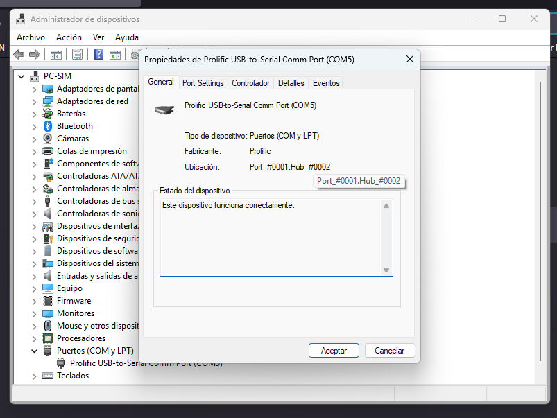
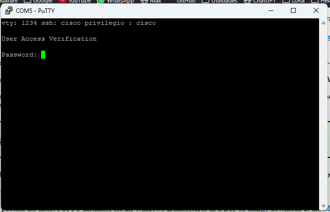
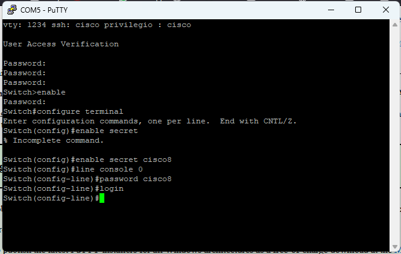
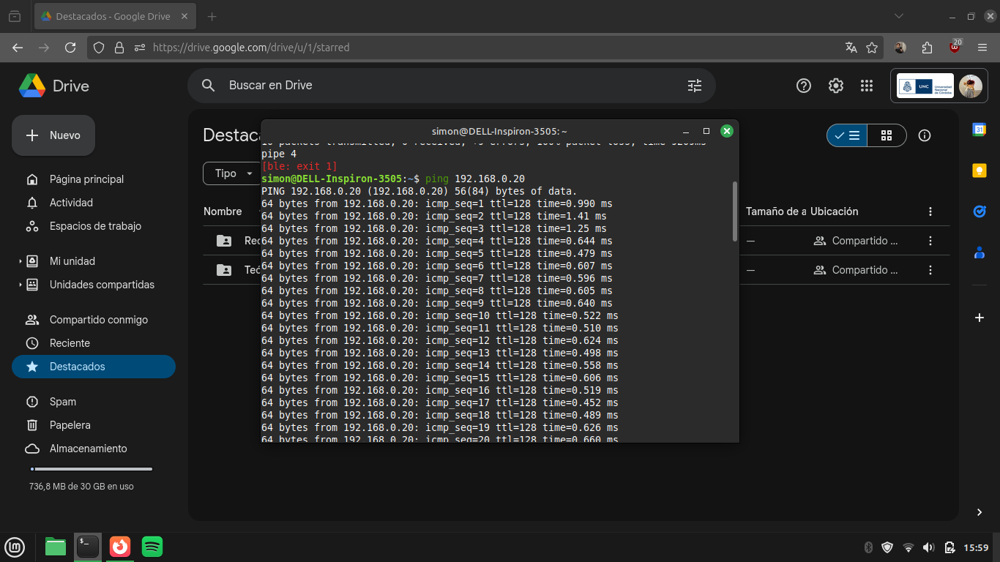
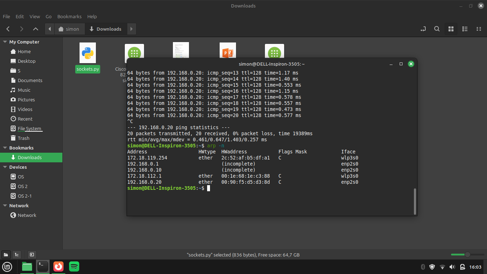

# Trabajo Practico nº 1 - Parte II - Manejo de equipamiento físico, recuperación de contraseñas de equipos de red y establecimiento de red y análisis de tráfico.

**Institucion: UNC - Facultad de Ciencias Exactas, Físicas y Naturales**  
**Materia: Redes de Computadoras**

**Profesores**
- Facundo Oliva Cuneo (Teorico).
- Santiago Martín Henn (Laboratorios).

**Fecha: 27-03-2025** 

---
## Nombre del grupo: Sin Latencia Team

## Nombres de los integrantes
- Efrain G. Veliz S.
- Elio N. Ludueña
- Juan I. Sassi 
- Franco L. Cirrincione

## Información de los autores
- efrain.veliz@mi.unc.edu.ar
- nicoluduena@mi.unc.edu.ar
- juan.sassi@mi.unc.edu.ar
- francocirrincione@mi.unc.edu.ar

---

### Switch WS-C2950
- Modelos y Puertos
  - **WS-C2950-12:** 12 puertos 10/100 Mbps  
  - **WS-C2950-24:** 24 puertos 10/100 Mbps  
  - **WS-C2950SX-24:** 24 puertos 10/100 Mbps con 2 uplinks 1000BASE-SX  
  - **WS-C2950T-48:** 48 puertos 10/100 Mbps con 2 puertos 10/100/1000BASE-T  
  - **WS-C2950SX-48:** 48 puertos 10/100 Mbps con 2 uplinks 1000BASE-SX  

- Rendimiento
  - **Ancho de banda de conmutación:**  
    - Entre 8.8 Gbps y 13.6 Gbps según el modelo.
  - **Tasas de reenvío:**  
    - Desde 1.8 Mpps hasta 10.1 Mpps (basado en paquetes de 64 bytes).

- Memoria y Capacidad
  - 16 MB de DRAM y 8 MB de Flash.
  - 8 MB de buffer compartido entre puertos.
  - Capacidad de hasta 8000 direcciones MAC.

- Gestión y Protocolos
  - **Gestión:**  
    - Cisco Device Manager (interfaz web) y Cisco Network Assistant.
  - **Protocolos de administración:**  
    - Soporte para SNMP (v1, v2 y v3 no criptográfico) y Telnet.
    - Amplia variedad de MIBs para integración en plataformas de gestión.

- Seguridad
  - **Autenticación y Acceso:**  
    - 802.1x para control de acceso.
    - Integración con TACACS+ y RADIUS.
  - **Cifrado y Protección:**  
    - SSH versión 2 (SSHv2) para sesiones seguras.
    - Port security y Private VLAN Edge para segmentación y protección de puertos.

- Calidad de Servicio (QoS)
  - Soporta clasificación de tramas basada en IEEE 802.1p y re-clasificación con valores predeterminados.
  - Cuatro colas por puerto con:
    - **Strict Priority Scheduling:** Para aplicaciones sensibles como VoIP.
    - **Weighted Round Robin (WRR):** Garantiza atención a tráfico de baja prioridad.

- Conectividad Física y Estándares
  - **Factor de forma:**  
    - 1RU, para montaje en racks estándar.
  - **Conectores:**  
    - RJ-45 para 10BASE-T/100BASE-TX.
    - MT-RJ para los modelos SX (1000BASE-SX).
  - **Estándares soportados:**  
    - IEEE 802.1x, 802.3x, 802.1D, 802.1p, 802.1Q, 802.3u, 802.3ad, y 1000BASE-X.
  - **Redundancia de energía:**  
    - Compatibilidad con sistemas redundantes (Cisco RPS 675).

---

### Procedimiento
- a. Conectar una PC al puerto de consola del switch Cisco a 9600 baudios utilizando PUTTY.
  - Conectar el puerto de consola a una conversor a interfaz serial.

  

      
  

  
Figura 1: Puerto del conversor USB-RS232.

     

  - (Opcional) En caso de no tener interfaz serial, utilizar un conversor a USB. 
  - Conectar a la computadora para la conexion.
  - Utilizar administrador de dispositivos (Windows) o setserial (Linux) para determinar el puerto
  - Abrir putty, utilizar la siguiente configuracion:
    - Connection type: Serial
    - Serial line: el puerto determinado en el paso anterior.
    - Speed: 9600
  - (Opcional) Guardar la configuracion para uso en el futuro.
  - Open

- b. Acceder a las opciones de administración del switch y modificar claves de acceso.
  - Se accedió a las opciones de administración y se modificaron las claves de acceso. Luego se ingresó al modo privilegiado. Se accedió al modo de configuración global. Se configuró la clave para el modo privilegiado. Finalmente se estableció una clave de acceso por consola:
  
 

    

Figura 2: User Access Verification en PuTTY.

 

    

Figura 3: Enable Secret en PuTTY.

 

- c.Conectar dos computadoras al switch, configurar una red y testear conectividad.
Se asignaron direcciones IP manualmente en cada computadora y se realizó una prueba de conectividad con ping

    

Figura 4: Ping entre dos computadoras conectadas al switch.

 
- d. Configuración del puerto en modo mirroring y monitoreo del tráfico

1- Conectar las computadoras y el switch

En primer lugar debemos tener las dos computadoras (PC1 y PC2) conectadas al switch. Luego, conectar la tercera (PC3) al switch en el puerto que será utilizado como puerto espejo (mirroring).

2- Acceder al switch mediante consola.

Usar el cable de consola (RJ-45) y conectar el switch a una computadora con PuTTY.

3- Configurar el puerto en modo mirroring (SPAN - Switched Port Analyzer)

 -Ingresar en modo de configuración global:
 
      enable
      configure terminal
      
 -Configura el puerto de origen (los puertos donde están conectadas PC1 y PC2) para que sean monitoreados:
 
      monitor session 1 source interface fastethernet 0/X - both
      monitor session 1 source interface fastethernet 0/Y - both
      
 -Configura el puerto de destino (donde está conectada PC3) para recibir el tráfico duplicado:
 
      monitor session 1 destination interface fastethernet 0/Z
      
 -Guardar la configuración:
 
      write memory
    
4. Capturar el tráfico con Wireshark.
   
    En la PC3, instalar y abrir el programa.

    Seleccionar la interfaz de red conectada al switch.

    Iniciar la captura de paquetes y observar el tráfico entre PC1 y PC2.

5. Finalizar la sesión de monitoreo
   
    no monitor session 1
    write memory
   
   De esta forma configuramos correctamente el mirroring del tráfico y pudimos analizar la comunicación entre las computadoras en tiempo real.
---

### Actividades de parte 1 - Análisis de tráfico de la red

- Ejecutando arp -n en Cliente 1 (Miembro del equipo), se verá la dirección IP y la dirección MAC de los dispositivos con los que se ha comunicado.
- En Cliente 2 (Miembro de otro equipo), al ejecutar arp -n, se listarán las direcciones IP y MAC aprendidas.
- En el router, arp -n mostrará las direcciones IP y MAC de los hosts conectados a sus interfaces activas.

- Tablas arp:
 

    

Figura 5: Tabla de ARP.

 
