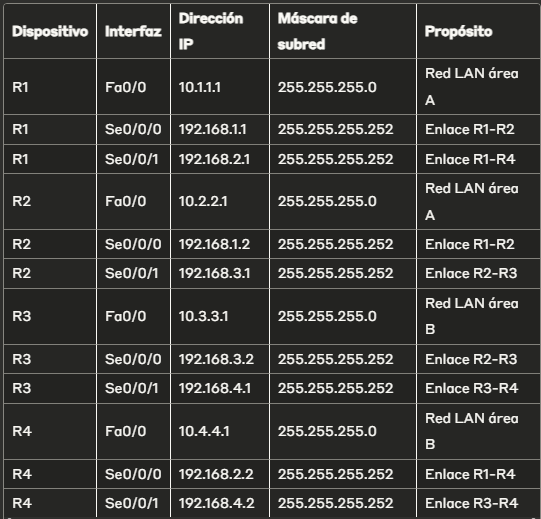

# Trabajo Práctico N°3: Evaluación de performance en redes y ruteo interno dinámico Open Shortest Path First (OSPF)
**Institucion: UNC - Facultad de Ciencias Exactas, Físicas y Naturales**  
**Materia: Redes de Computadoras**
**Profesores**
- Facundo Oliva Cuneo (Teorico).
- Santiago Martín Henn (Laboratorios).

---

**Nombre del grupo: Sin Latencia Team**

**Nombres de los integrantes**
- Efrain G. Veliz S.
- Elio N. Ludueña
- Juan I. Sassi 
- Franco L. Cirrincione

**Información de los autores**
- efrain.veliz@mi.unc.edu.ar
- nicoluduena@mi.unc.edu.ar
- juan.sassi@mi.unc.edu.ar
- francocirrincione@mi.unc.edu.ar

---

## 1. MARCO TEÓRICO
### 1.1 Introducción al protocolo OSPF
Open Shortest Path First (OSPF) es un protocolo de enrutamiento dinámico de estado de enlace (Link-State) que utiliza el algoritmo de Dijkstra para calcular la ruta más corta hacia cada destino en la red. OSPF es un protocolo de Gateway Interior (IGP) desarrollado para redes IP que opera dentro de un Sistema Autónomo (AS).
Características principales de OSPF:

Protocolo de estado de enlace: Cada router mantiene una base de datos topológica completa de la red
Convergencia rápida: Responde rápidamente a cambios en la topología
Soporte para VLSM: Variable Length Subnet Masking
Autenticación: Soporta autenticación de mensajes
Áreas jerárquicas: Permite dividir la red en áreas para mejorar la escalabilidad

### 1.2 Clases de redes IP
Las direcciones IP se clasifican tradicionalmente en clases:

Clase A: 1.0.0.0 a 126.255.255.255 (máscara /8)

Primer octeto: 1-126
16,777,214 hosts por red


Clase B: 128.0.0.0 a 191.255.255.255 (máscara /16)

Primer octeto: 128-191
65,534 hosts por red


Clase C: 192.0.0.0 a 223.255.255.255 (máscara /24)

Primer octeto: 192-223
254 hosts por red

### 1.3 Algoritmo de Dijkstra (Shortest Path First)
El algoritmo de Dijkstra encuentra la ruta más corta desde un nodo origen hacia todos los demás nodos en un grafo ponderado. En OSPF:

Inicialización: Se marca el nodo origen con distancia 0
Selección: Se selecciona el nodo no visitado con menor distancia
Actualización: Se actualizan las distancias de los nodos vecinos
Repetición: Se repite hasta visitar todos los nodos

### 1.4 Teoría de grafos aplicada a redes OSPF
En OSPF, la red se representa como un grafo dirigido donde:

Nodos (vértices): Representan routers y redes
Aristas (edges): Representan enlaces entre routers
Pesos: Representan el costo de cada enlace (basado en ancho de banda)

La Base de Datos de Estado de Enlace (LSDB) contiene la representación completa del grafo de la red, permitiendo que cada router calcule independientemente las mejores rutas usando el algoritmo de Dijkstra.

### 1.5 Áreas OSPF
OSPF utiliza una jerarquía de áreas para mejorar la escalabilidad:

Área Backbone (Área 0): Área central que conecta todas las demás áreas
Áreas regulares: Áreas que se conectan al backbone
Áreas especiales: Stub, NSSA, etc.

---

## 2. DESARROLLO DEL TRABAJO PRÁCTICO
### 2.1 Diseño de la topología
La topología implementada consta de:

4 routers (R1, R2, R3, R4) interconectados
4 switches (S1, S2, S3, S4) conectados a cada router
Hosts conectados a cada switch
Enlaces punto a punto entre routers

    [PC1]--[S1]--[R1]-------[R2]--[S2]--[PC2]
                   |         |
                   |         |
    [PC4]--[S4]--[R4]-------[R3]--[S3]--[PC3]

### 2.2 Esquema de direccionamiento IP
Tabla de direccionamiento:

<br>
<p align="center">
    
</p>
<p align="center">Figura 1: Tabla de direccionamiento.</p>
<br>

### 2.3 Configuración básica de OSPF
Configuración del Router R1:
```cisco
R1(config)# router ospf 1
R1(config-router)# network 10.1.1.0 0.0.0.255 area 0
R1(config-router)# network 192.168.1.0 0.0.0.3 area 0
R1(config-router)# network 192.168.2.0 0.0.0.3 area 0
```
Configuración del Router R2:
```cisco
R2(config)# router ospf 1
R2(config-router)# network 10.2.2.0 0.0.0.255 area 0
R2(config-router)# network 192.168.1.0 0.0.0.3 area 0
R2(config-router)# network 192.168.3.0 0.0.0.3 area 0
```
Configuración del Router R3:
```cisco
R3(config)# router ospf 1
R3(config-router)# network 10.3.3.0 0.0.0.255 area 1
R3(config-router)# network 192.168.3.0 0.0.0.3 area 1
R3(config-router)# network 192.168.4.0 0.0.0.3 area 1
```
Configuración del Router R4:
```cisco
R4(config)# router ospf 1
R4(config-router)# network 10.4.4.0 0.0.0.255 area 1
R4(config-router)# network 192.168.2.0 0.0.0.3 area 1
R4(config-router)# network 192.168.4.0 0.0.0.3 area 1
```

### 2.4 Configuración de áreas OSPF
Área A (Área 0 - Backbone): R1 y R2
Área B (Área 1): R3 y R4

### 2.5 Verificación del funcionamiento
Comandos de verificación utilizados:
```cisco
# Verificar tabla de enrutamiento
show ip route

# Verificar vecinos OSPF
show ip ospf neighbor

# Verificar base de datos OSPF
show ip ospf database

# Verificar interfaces OSPF
show ip ospf interface

# Verificar información del protocolo OSPF
show ip protocols
```

### 2.6 Modificación de costos OSPF
Para observar el comportamiento del protocolo, se modificaron los costos:
```cisco
R2(config)# interface serial0/0/0
R2(config-if)# ip ospf cost 100
```
Pruebas con traceroute:

Antes de la modificación: Ruta directa R1-R2
Después de la modificación: Ruta alternativa R1-R4-R3-R2

### 2.7 Configuración de ruta predeterminada
En R1 se configuró:
```cisco
R1(config)# interface loopback0
R1(config-if)# ip address 203.0.113.1 255.255.255.255
R1(config)# ip route 0.0.0.0 0.0.0.0 loopback0
R1(config)# router ospf 1
R1(config-router)# default-information originate
```

---

## 3. ANÁLISIS DE RESULTADOS
### 3.1 Mensajes OSPF identificados
Durante la implementación se observaron los siguientes tipos de mensajes OSPF:

Hello: Descubrimiento y mantenimiento de vecinos
Database Description (DBD): Intercambio de información de LSDB
Link State Request (LSR): Solicitud de LSAs específicos
Link State Update (LSU): Propagación de información de estado de enlace
Link State Acknowledgment (LSAck): Confirmación de recepción

### 3.2 Impacto de la caída de interfaces
Escenario analizado: Caída de la interfaz R2-R1

Tiempo de convergencia: Aproximadamente 30 segundos
Ruta alternativa: Tráfico se redirige a través de R4-R3
LSAs generados: Se propagan nuevos LSAs informando la caída del enlace
Actualización de LSDB: Todos los routers actualizan su base de datos

### 3.3 Diferencia entre RIB y FIB
RIB (Routing Information Base):

Contiene todas las rutas conocidas por el router
Incluye rutas de múltiples protocolos de enrutamiento
Se utiliza para el proceso de decisión de enrutamiento

FIB (Forwarding Information Base):

Contiene únicamente las mejores rutas seleccionadas del RIB
Se utiliza para el reenvío actual de paquetes
Optimizada para consultas rápidas durante el forwarding

### 3.4 Análisis de la LSDB
La Base de Datos de Estado de Enlace mostró:

Router LSAs: Información sobre cada router y sus enlaces
Network LSAs: Información sobre redes multi-acceso
Summary LSAs: Información entre áreas (cuando se configuraron múltiples áreas)

---

## 4. CONCLUSIONES
### 4.1 Conclusiones técnicas

OSPF demostró ser eficiente en la convergencia de la red, adaptándose rápidamente a cambios topológicos.
La segmentación en áreas permite una mejor escalabilidad y reduce el tráfico de control entre routers.
El algoritmo de Dijkstra calcula efectivamente las rutas más cortas, considerando los costos configurados en cada enlace.
La modificación de costos permite el control granular del tráfico, forzando rutas específicas según las necesidades de la red.
La redistribución de rutas predeterminadas facilita la conectividad hacia redes externas sin configuración manual en cada router.

### 4.2 Ventajas observadas de OSPF

Convergencia rápida: Cambios en la topología se propagan rápidamente
Sin bucles de enrutamiento: El algoritmo SPF garantiza rutas libres de bucles
Balanceador de carga: Permite múltiples rutas de igual costo
Escalabilidad: El diseño jerárquico con áreas mejora el rendimiento en redes grandes

### 4.3 Consideraciones de implementación

Planificación del direccionamiento: Es crucial para evitar conflictos y facilitar la administración
Diseño de áreas: Debe considerar la cantidad de routers y la topología física
Configuración de costos: Permite optimizar el uso del ancho de banda disponible
Monitoreo continuo: Es necesario para detectar problemas de convergencia o vecindad

### 4.4 Aplicaciones prácticas
Este trabajo práctico proporciona las bases para:

Diseño de redes corporativas medianas y grandes
Implementación de redundancia y tolerancia a fallos
Optimización del rendimiento de la red mediante control de costos
Integración con proveedores de servicios de Internet

---

## 5. REFERENCIAS

Cisco Systems. (2023). "OSPF Configuration Guide"
RFC 2328 - OSPF Version 2
FRRouting Documentation. "OSPF Protocol Implementation"
Dijkstra, E. W. (1959). "A note on two problems in connexion with graphs"


Fecha de realización: Mayo 2025
Herramienta utilizada: Cisco Packet Tracer
Protocolo implementado: OSPFv2