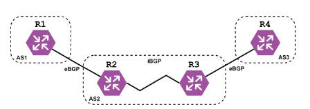
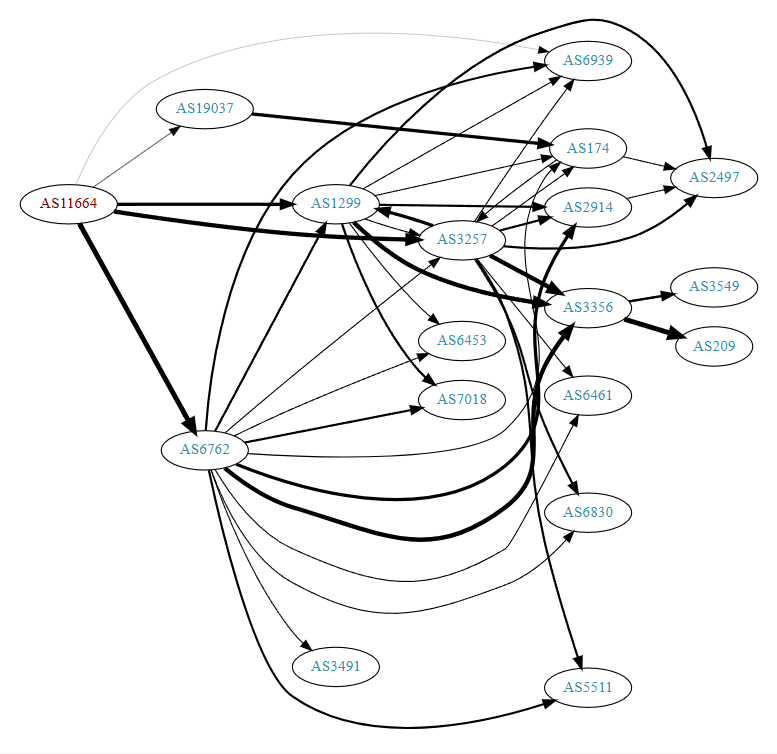

# Trabajo Práctico N°4: Ruteo externo dinámico y sistemas autónomos
**Institucion: UNC - Facultad de Ciencias Exactas, Físicas y Naturales**  
**Materia: Redes de Computadoras**
**Profesores**
- Facundo Oliva Cuneo (Teorico).
- Santiago Martín Henn (Laboratorios).

---

**Nombre del grupo: Sin Latencia Team**

**Nombres de los integrantes**
- Efrain G. Veliz S.
- Elio N. Ludueña
- Juan I. Sassi 
- Franco L. Cirrincione

**Información de los autores**
- efrain.veliz@mi.unc.edu.ar
- nicoluduena@mi.unc.edu.ar
- juan.sassi@mi.unc.edu.ar
- francocirrincione@mi.unc.edu.ar

---
# Parte I - Integración de conceptos, actividades online e investigación

## 1) Investigar y elaborar reportes sobre los siguientes conceptos e información sobre AS:
- a) ¿Qué es un Autonomous System (AS)?
- b) ¿Qué es un Autonomous System Number (ASN) y cómo está conformado?
- c) Buscar 3 ejemplos de ASN de empresas, universidades u organizaciones.
- d) ¿Cual es el ASN de tu conexión actual? Averigualo. Recopilar la información que consideres más
relevante sobre tu ASN ¿Qué protocolos soporta (IPv4/6, multicast, etc)?
### Respuestas:
- a) Un Autonomous System (AS), o Sistema Autónomo, es un conjunto de direcciones IP (IPv4 o IPv6) agrupadas bajo una misma política de enrutamiento y que están administradas por una única entidad u organización. Este conjunto de redes funciona como una unidad coherente desde el punto de vista del enrutamiento exterior, y se comunica con otros sistemas autónomos mediante protocolos de enrutamiento de tipo interdominio, como el BGP (Border Gateway Protocol).
- b) Un Autonomous System Number (ASN) es un identificador numérico único asignado a cada Sistema Autónomo (AS). Este número permite a los sistemas autónomos intercambiar información de enrutamiento a través del protocolo BGP (Border Gateway Protocol), que es el protocolo estándar para el enrutamiento entre dominios en Internet.Pueden ser publicos o privados, expresarse como decimal simple (ej: 13335) o con punto (ej: 1.10 para 65546) y tiene dos formatos 16 bits (clasico de 1 al 65535) y el de 32 bits(expandido de 65536 hasta 4294967295).
- c) ejemplos de ASN:
    - Google Inc -> ASN:15169 -> nombre:GOOGLE -> Estados unidos, servicios en la nube,busquedas, etc.
    - Universidad Nacional de Córdoba(Argentina) -> ASN:262236 -> nombre:UNC-AS -> Argentina,Red academica y administrativa de la unuiversidad.
    - Netflix Inc -> ASN:2906 -> nombre:NETFLIX -> Estados unidos, transmision de contenido multimedia.
- d) Estas pruebas se realizaron en la computadora de un compañero dle grupo y dio los siguientes resultados:
    ASN: AS7303 (Telecom Argentina SA), ubicado en argentina y es un tipo de red ISP (Proveedor de Servicios de Internet) con una asignacion de IP aproximadamente de 8.4 millones.Rango de IP asociado: 190.16.0.0/14. Soporta IPv4 e IPv6 (Multicast: Generalmente no disponible para usuarios residenciales).
    
## 2) Investigar y elaborar reportes sobre los siguientes conceptos e información sobre BGP:
- a) ¿Qué es el Border Gateway Protocol (BGP)?
- b) Resumir el funcionamiento del BGP a través de sus procedimientos funcionales: adquisición de
vecino, detección de vecino alcanzable, detección de red alcanzable. Explicar tipos de mensajes y
formato de paquetes en BGP.
- c) Explicar la diferencia entre BGP externo (eBGP) y BGP interno (iBGP) en función de la
información que se intercambia dentro de un AS. En el siguiente ejemplo ¿Cuál(es) AS son de
tránsito?
     
    

        
    

    
Figura 1: ejemplo AS.

     
- d) Buscar las conexiones del AS en mi conexión actual. ¿Cuántas conexiones eBGP tiene mi AS?,incluir un gráfico de los AS a uno o dos grados de separación (Ejemplo).
- e) Buscar las conexiones del AS conectándome a alguna red distinta a la del punto anterior (puede ser 4G/5G de mi teléfono, alguna red en la facultad, etc.). ¿Qué diferencias/similitudes puedo identicar?
- f) Investigar algún problema en enrutamiento BGP que haya tenido un impacto en servicios de red a nivel nacional/internacional. Elaborar un resumen de las causas y las consecuencias.

## **Respuestas:**
### **a) El BGP (Border Gateway Protocol)** 
Es un protocolo de enrutamiento de capa de aplicación (capa 7) que opera sobre TCP, es de tipo vector de ruta diseñado para intercambiar información de enrutamiento entre diferentes Sistemas Autónomos (AS) en Internet. Es el protocolo principal de enrutamiento interdominio, y permite construir la tabla de enrutamiento global de Internet, asegurando que los paquetes lleguen a su destino a través del mejor camino disponible.

### **b) Funcionamiento del **BGP** y procedimientos funcionales**
BGP funciona a través de sesiones entre pares o vecinos (peers) que intercambian rutas y atributos. Sus procedimientos funcionales clave son:
    - 1. **Adquisición de vecino (Neighbor Acquisition):**
        * Dos routers BGP (vecinos) establecen una **conexión TCP en el puerto 179**.
        * Una vez conectados, se intercambian mensajes **OPEN** para iniciar la sesión BGP.
        * Se definen parámetros como número de AS, ID del router, versión de BGP, etc.

    - 2. **Detección de vecino alcanzable (Keepalive):**
        * Los routers envían periódicamente mensajes **KEEPALIVE** para confirmar que la conexión está activa.
        * Si no se reciben mensajes en un tiempo definido (hold time), la sesión se considera caída.

    - 3. **Detección de red alcanzable (Route Advertisement):**
        * Una vez establecida la sesión, los routers BGP intercambian mensajes **UPDATE**, anunciando nuevas rutas o retirando rutas que ya no están disponibles.
        * Estas rutas incluyen atributos como el **AS\_PATH**, **NEXT\_HOP**, **MED**, **LOCAL\_PREF**, etc.

- **Tipos de mensajes en BGP:**
    1. **OPEN**: Inicia la sesión entre dos vecinos BGP.
    2. **UPDATE**: Anuncia nuevas rutas o elimina rutas obsoletas.
    3. **KEEPALIVE**: Mantiene activa la sesión entre routers.
    4. **NOTIFICATION**: Informa errores o condiciones excepcionales y termina la conexión.

- **Formato básico de un paquete BGP:**
Todos los mensajes BGP comienzan con un **header de 19 bytes**, que incluye:
    * **Marker** (16 bytes): para autenticación o compatibilidad.
    * **Length** (2 bytes): tamaño total del mensaje.
    * **Type** (1 byte): indica el tipo de mensaje (1=OPEN, 2=UPDATE, etc.).

Luego, cada tipo de mensaje tiene su propio formato específico (por ejemplo, los UPDATE incluyen prefijos IP, atributos de ruta, etc.).

### **c) Diferencia entre eBGP e iBGP**

| Característica           | **eBGP** (External BGP)                             | **iBGP** (Internal BGP)                           |
| ------------------------ | --------------------------------------------------- | ------------------------------------------------- |
| Ámbito                   | Entre **diferentes AS**                             | Dentro del **mismo AS**                           |
| Intercambio de rutas     | Rutas entre AS vecinos                              | Rutas aprendidas dentro del mismo AS              |
| Reescritura del AS\_PATH | Se agrega el número del AS local                    | No se modifica el AS\_PATH                        |
| TTL predeterminado       | 1 (router vecino debe estar directamente conectado) | 255 (se puede enrutar dentro del AS)              |
| Uso típico               | Conexiones entre ISPs o redes grandes               | Distribución interna de rutas aprendidas por eBGP |

En nuestro ejemplo **AS2** es de transito. y sirve de pente entre AS1 y AS3.

---- 

### **d) Conexionado AS actual.** 
Actualmente mi conexion publica pertenece al AS11664, administrado por Techtel LMDS Comunicaciones Interactivas S.A., un proveedor de servicios de telecomunicaciones en Argentina.Según la herramienta bgpview.io, el AS11664 mantiene conexiones eBGP con al menos 8 sistemas autónomos distintos. Estos incluyen:
    - AS3549 (Level 3 LATAM)
    - AS6762 (Telecom Italia Sparkle)
    - AS10481 (Prima S.A. - Arnet)
    - AS3356 (Lumen / Level 3)
    - AS16814, AS3816, entre otros.

Estas conexiones permiten el intercambio de rutas con diferentes redes regionales e internacionales, cumpliendo el rol de un AS de tránsito, al transportar tráfico entre otros AS que no son de su propiedad directa.

 

    

Figura 2: Grafico de los AS a uno o dos grados de separación.

 

Este gráfico muestra visualmente las relaciones de interconexión que el AS11664 mantiene directamente con otros AS, así como las conexiones de segundo grado. Estas relaciones son fundamentales para garantizar redundancia, rutas alternativas y eficiencia en el tránsito de datos.

--- 

### **e) conexionado a una Red distinta.** 
Para esta parte, se realizó una prueba de conexión utilizando **una red móvil 4G de la operadora Claro Argentina**. Al consultar la IP pública, se determinó que la conexión pertenece al **AS22085** (Claro Argentina).

    - Comparación entre AS11664 y AS22085

| Característica              | **AS11664 (Techtel)**                          | **AS22085 (Claro Argentina)**                   |
| --------------------------- | ---------------------------------------------- | ----------------------------------------------- |
| Tipo de proveedor           | ISP regional / corporativo                     | ISP móvil y fijo de alcance nacional            |
| Tipo de conexión analizada  | Conexión residencial/corporativa fija          | Red móvil 4G                                    |
| Número de conexiones eBGP   | Al menos 8                                     | Al menos 6                                      |
| AS de tránsito              | Sí                                             | Sí                                              |
| Infraestructura orientada a | Empresas, enlaces dedicados                    | Usuarios móviles, consumo masivo                |
| Latencia promedio observada | Menor, más estable                             | Mayor variabilidad debido a la red móvil        |

    Conclusión:
    Ambos AS operan como proveedores de tránsito con múltiples conexiones eBGP. Sin embargo, AS22085 prioriza la conectividad móvil , mientras que AS11664 se enfoca en servicios fijos y empresariales. Las rutas entre ellos difieren, pero ambos permiten acceso completo a la red global mediante BGP.

---

### **f) Problema de enrutamiento BGP con impacto internacional: Caso de Cloudflare (2019)**

- Contexto del incidente
    El **24 de junio de 2019**, Cloudflare —una de las redes de distribución de contenido (CDN) más grandes del mundo— experimentó interrupciones globales en sus servicios debido a un **mal anuncio de rutas BGP**.

- Causas del problema
    * El **ISP Verizon (AS701)** aceptó rutas incorrectas originadas por un pequeño proveedor, **Allegheny Technologies (AS396531)**, que había sido mal configurado por **DQE Communications (AS33154)**.
    * Estas rutas **exageraban la cercanía de ciertos prefijos IP a través de Allegheny**, redirigiendo tráfico masivo que no podía manejar.
    * Verizon propagó estas rutas incorrectas a otros operadores, lo que afectó a miles de usuarios.

- Consecuencias
    * Tráfico global fue desviado erróneamente hacia infraestructuras no preparadas para manejarlo.
    * Servicios como Cloudflare, Amazon, Facebook y otros experimentaron degradaciones de rendimiento o caídas parciales.
    * Se evidenció la **falta de filtrado BGP adecuado** por parte de operadores importantes.
    * A raíz de esto, se reforzó la necesidad de implementar **RPKI (Resource Public Key Infrastructure)** y **validaciones estrictas de prefijos**.

- Conclusión
    * Este caso demostró cómo **una mala configuración BGP en una red pequeña puede escalar rápidamente** y afectar a millones de usuarios, si no existen mecanismos de control y validación adecuados a nivel de los operadores de tránsito.

---
# Parte II - Simulaciones y análisis