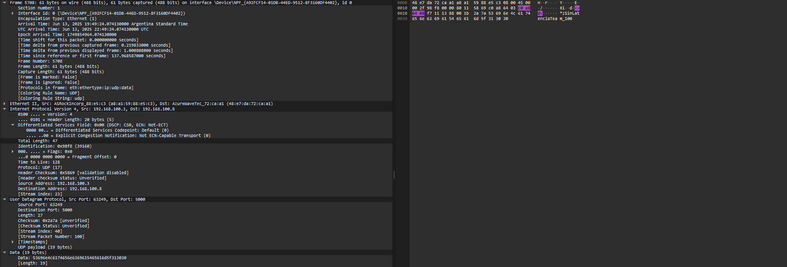

# Trabajo Práctico nº 5

**Institución:** UNC - Facultad de Ciencias Exactas, Físicas y Naturales  
**Materia:** Redes de Computadoras

**Profesores:**
- Facundo Oliva Cuneo (Teórico)
- Santiago Martín Henn (Laboratorios)

**Fecha:** 14-06-2025

---
## Nombre del grupo: Sin Latencia Team

## Nombres de los integrantes
- Efrain G. Veliz S.
- Elio N. Ludueña
- Juan I. Sassi
- Franco L. Cirrincione

## Información de los autores
- efrain.veliz@mi.unc.edu.ar
- nicoluduena@mi.unc.edu.ar
- juan.sassi@mi.unc.edu.ar
- francocirrincione@mi.unc.edu.ar

---

## Resumen

En este trabajo se desarrollaron scripts en Python para enviar y recibir paquetes mediante los protocolos TCP y UDP entre dos equipos, con intervalos configurables y carga útil identificatoria. Se registraron todos los eventos con marca temporal, lo que permitió calcular métricas como latencia y jitter. Se analizó el tráfico mediante Wireshark, comparando el comportamiento de ambos protocolos. Finalmente, se incorporó encriptación simétrica sobre la carga útil y se exploraron métodos de protección para comunicaciones seguras a larga distancia.

**Palabras clave:** TCP, UDP, latencia, jitter, encriptación, Python, sockets

---

## Introducción

En el estudio de las redes de computadoras, comprender el comportamiento de los protocolos de transporte como TCP y UDP resulta fundamental. Ambos tienen características muy distintas: TCP ofrece confiabilidad a costa de mayor latencia, mientras que UDP sacrifica garantías para lograr eficiencia. Este trabajo práctico propone desarrollar y analizar programas que operen sobre ambos protocolos, medir su desempeño y agregar una capa de seguridad mediante encriptación, simulando un entorno de red realista.

---

# Marco teórico / Modelo / Metodología

## Protocolos TCP y UDP

TCP (Transmission Control Protocol) es un protocolo orientado a la conexión. Asegura la entrega ordenada y sin errores de los paquetes, mediante mecanismos como confirmaciones (ACKs) y retransmisiones. Es ideal para aplicaciones donde la confiabilidad es crítica (como web, correo, archivos).

UDP (User Datagram Protocol) es un protocolo no orientado a la conexión. Envía los datos sin confirmar su recepción ni ordenar los mensajes, lo que reduce la sobrecarga y mejora la velocidad. Se utiliza en aplicaciones como videollamadas, streaming o juegos en línea.

## Métricas: latencia y jitter

- Latencia: tiempo entre el envío y la recepción de un paquete.

- Latencia promedio: media de todas las latencias.

- Latencia máxima/mínima: extremos en la distribución.

- Jitter: variabilidad de la latencia; mide la diferencia entre latencias sucesivas.
Es importante en aplicaciones en tiempo real como voz y video.

## Metodología

Se desarrollaron scripts en Python utilizando la librería `socket` para la comunicación TCP y UDP. Los scripts permiten configurar el intervalo de envío y el contenido de los paquetes. Se implementó logging de los eventos con timestamp y se utilizó la librería `cryptography` para encriptar la carga útil. Se capturó el tráfico con Wireshark para analizar los paquetes y se calcularon métricas de latencia y jitter a partir de los logs generados.

---

## Desarrollo y Resultados

### 1. Scripts TCP

Se implementaron dos scripts: `tcp_client.py` y `tcp_server.py`. El cliente envía 100 paquetes con identificador único y el servidor los recibe, ambos logueando los eventos con timestamp. El intervalo de envío es configurable (1 segundo en las pruebas). Se capturó el tráfico con Wireshark y se verificó la correcta transmisión de los paquetes.


*Figura 1: Paquete TCP capturado en Wireshark mostrando la carga útil identificatoria enviada por el cliente.*

*Figura 2: Respuesta del servidor capturada en Wireshark, mostrando la confirmación o acuse de recibo (ACK) correspondiente a la comunicación TCP.*


### 2. Scripts UDP

De forma análoga, se desarrollaron `udp_client.py` y `udp_server.py`, con la misma lógica de identificación, logging y captura de tráfico. En la captura "UDP e1.png" se muestra un paquete UDP recibido correctamente.


*Figura 3: Paquete UDP capturado en Wireshark mostrando la carga útil (envio 100) identificatoria enviada por el cliente.*


### 3. Logging y métricas

Para analizar el desempeño de la comunicación, se implementó el script `latencia_jitter.py`, que procesa los logs generados por los scripts cliente y servidor. El script busca los identificadores únicos de cada paquete enviado y recibido, calcula la diferencia temporal (latencia) para cada uno y obtiene la latencia promedio, máxima, mínima y el jitter (variación entre latencias sucesivas). Esto permite comparar objetivamente el comportamiento de TCP y UDP.

Las fórmulas utilizadas son:

- **Latencia de un paquete:**
  \[ \text{Latencia}_i = t_{\text{recibido},i} - t_{\text{enviado},i} \]
- **Latencia promedio:**
  \[ \text{Latencia}_{\text{prom}} = \frac{1}{N} \sum_{i=1}^{N} \text{Latencia}_i \]
- **Latencia máxima/mínima:**
  \[ \text{Latencia}_{\text{max}} = \max(\text{Latencia}_i) \qquad \text{Latencia}_{\text{min}} = \min(\text{Latencia}_i) \]
- **Jitter:**
  \[ \text{Jitter} = \frac{1}{N-1} \sum_{i=2}^{N} |\text{Latencia}_i - \text{Latencia}_{i-1}| \]

A continuación se muestran los resultados obtenidos directamente del log:

```log
TCP Metrics:
  Average Latency: 0.493612 seconds
  Maximum Latency: 0.807084 seconds
  Minimum Latency: 0.429011 seconds
  Jitter: 0.048874 seconds
UDP Metrics:
  Average Latency: 0.510347 seconds
  Maximum Latency: 0.562428 seconds
  Minimum Latency: 0.451245 seconds
  Jitter: 0.035528 seconds
```

| Protocolo | Latencia Promedio (s) | Latencia Máxima (s) | Latencia Mínima (s) | Jitter (s) |
|-----------|----------------------|---------------------|---------------------|------------|
| TCP       | 0.49                 | 0.81                | 0.43                | 0.05       |
| UDP       | 0.51                 | 0.56                | 0.45                | 0.04       |

### 4. Comparación de paquetes TCP y UDP

En las capturas "TCP Wireshark.png" y "UDP Wireshark.png" se observan las diferencias en los encabezados y la estructura de los paquetes. TCP incluye mecanismos de control de flujo y confirmación, mientras que UDP es más simple y rápido.

| Característica      | TCP                  | UDP                |
|---------------------|----------------------|--------------------|
| Orientación         | Conexión             | No conexión        |
| Fiabilidad          | Sí                   | No                 |
| Orden de entrega    | Garantizado          | No garantizado     |
| Velocidad           | Menor                | Mayor              |
| Uso típico          | Web, email, archivos | Streaming, VoIP    |

### 5. Encriptación de la carga útil

Se utilizó encriptación simétrica AES (librería `cryptography`) en modo ECB para cifrar la carga útil de los paquetes. El proceso de cifrado y descifrado en los scripts de Python es el siguiente:

```python
from cryptography.hazmat.primitives.ciphers import Cipher, algorithms, modes
from cryptography.hazmat.primitives import padding
from cryptography.hazmat.backends import default_backend

# Cifrado
cipher = Cipher(algorithms.AES(AES_KEY), modes.ECB(), backend=default_backend())
encryptor = cipher.encryptor()
padder = padding.PKCS7(algorithms.AES.block_size).padder()
padded_data = padder.update(mensaje.encode()) + padder.finalize()
encrypted_message = encryptor.update(padded_data) + encryptor.finalize()

# Descifrado
decryptor = cipher.decryptor()
padded_data = decryptor.update(encrypted_message) + decryptor.finalize()
unpadder = padding.PKCS7(algorithms.AES.block_size).unpadder()
data = unpadder.update(padded_data) + unpadder.finalize()
mensaje = data.decode()
```

Este método garantiza que la carga útil transmitida no sea legible en tránsito, como se observa en las capturas "TCP encriptado.pcapng" y "UDP encriptado.pcapng". AES es ampliamente utilizado por su seguridad y eficiencia, aunque el modo ECB no es recomendable para grandes volúmenes de datos o patrones repetitivos.

#### Otras librerías de encriptación
- **Python:**
  - `pycryptodome`: Alternativa moderna y compatible con PyCrypto, soporta AES, DES, RSA, etc.
  - `PyNaCl`: Basada en libsodium, orientada a cifrado moderno y seguro (Curve25519, Salsa20, etc).
  - `ssl` (estándar): Para cifrado de sockets y conexiones seguras (TLS/SSL).
- **C/C++:**
  - `OpenSSL` (C): Biblioteca robusta para cifrado simétrico y asimétrico, ampliamente usada en sistemas y servidores.
    ```c
    // Ejemplo de cifrado AES en C con OpenSSL
    #include <openssl/aes.h>
    AES_KEY enc_key;
    AES_set_encrypt_key(key, 128, &enc_key);
    AES_encrypt(input, output, &enc_key);
    ```
  - `libsodium` (C/C++): Biblioteca moderna, fácil de usar y segura para cifrado, hashing y autenticación.
  - `Crypto++` (C++): Biblioteca de propósito general para cifrado simétrico, asimétrico y hash.


*Figura 4: Paquete TCP encriptado capturado en Wireshark mostrando la carga útil.*

*Figura 5: Segundo paquete TCP encriptado capturado en Wireshark mostrando la carga útil.*

Comparándolas entre sí, se puede ver cómo cambia ampliamente el payload encriptado aunque en el mensaje solo exista un cambio de un carácter. Adicionalmente, comparado con la Figura 1, podemos ver cómo la información ahora está encriptada.


*Figura 6: Paquete UDP encriptado capturado en Wireshark mostrando la carga útil.*

*Figura 7: Segundo paquete UDP encriptado capturado en Wireshark mostrando la carga útil.*

De forma análoga, podemos ver que sucede lo mismo en UDP y constatamos la encriptación comparándola con la Figura 3.

#### Diferencias entre encriptación simétrica y asimétrica
| Característica         | Simétrica                                 | Asimétrica                                 |
|-----------------------|-------------------------------------------|--------------------------------------------|
| Ejemplo               | AES, DES, RC4                             | RSA, ECC, ElGamal                         |
| Claves                | Una sola clave compartida                 | Par de claves: pública y privada           |
| Velocidad             | Alta (rápida)                             | Baja (lenta)                               |
| Seguridad             | Depende del secreto de la clave            | Seguridad basada en dificultad matemática  |
| Intercambio de clave  | Requiere canal seguro                     | No requiere canal seguro                   |
| Uso típico            | Cifrado de datos en bloque, VPN, archivos | Intercambio de claves, firmas digitales    |
| Ventajas              | Eficiencia, simple implementación         | Facilita comunicación segura sin clave previa |
| Desventajas           | Problemas de distribución de clave         | Más lento, requiere mayor poder de cómputo |

*Ejemplo de uso combinado: en la práctica, se suele usar encriptación asimétrica para intercambiar una clave simétrica de sesión, y luego cifrar el resto de la comunicación con el método simétrico.*

#### ¿Cómo encriptar a distancia sin clave previa?

Cuando dos computadoras están separadas geográficamente y nunca han intercambiado información previamente, el principal desafío es establecer un canal seguro sin compartir una clave secreta de antemano. Para resolver esto, se utiliza encriptación asimétrica (por ejemplo, RSA, Diffie-Hellman o curvas elípticas) para negociar una clave simétrica de sesión de manera segura.

**Conceptualmente, el proceso sería el siguiente:**

1. **Generación de claves:**
   - Cada computadora genera un par de claves asimétricas (pública y privada).
2. **Intercambio de claves públicas:**
   - Al iniciar la comunicación, ambas computadoras intercambian sus claves públicas. Este intercambio puede hacerse abiertamente, ya que la clave pública no compromete la seguridad.
3. **Negociación de clave de sesión:**
   - Utilizando un algoritmo como Diffie-Hellman o cifrando una clave simétrica aleatoria (por ejemplo, una clave AES) con la clave pública del destinatario, ambas partes acuerdan una clave de sesión secreta que solo ellas conocen.
4. **Comunicación cifrada:**
   - A partir de ese momento, toda la comunicación se cifra usando la clave simétrica acordada, que es mucho más eficiente para grandes volúmenes de datos.

**¿Cómo se implementaría esto en los scripts?**
- Se agregaría una fase inicial de handshake:
  - El cliente y el servidor generarían sus claves asimétricas (por ejemplo, usando `cryptography.hazmat.primitives.asymmetric.rsa` en Python).
  - Intercambiarían las claves públicas al conectarse.
  - El cliente generaría una clave de sesión aleatoria y la cifraría con la clave pública del servidor, enviándosela.
  - El servidor descifraría la clave de sesión con su clave privada.
- A partir de ese punto, ambos usarían la clave de sesión para cifrar y descifrar los mensajes con AES u otro cifrado simétrico.

**Ejemplo conceptual de flujo:**
1. Cliente y servidor intercambian claves públicas.
2. Cliente genera clave AES de sesión y la envía cifrada con la clave pública del servidor.
3. Servidor descifra la clave AES de sesión.
4. Ambos usan esa clave para cifrar el resto de la comunicación.


---

## Discusión y conclusiones

El desarrollo permitió comparar el comportamiento de TCP y UDP en un entorno controlado, observando las diferencias en latencia, jitter y fiabilidad. La encriptación de la carga útil añade una capa de seguridad, aunque requiere considerar el método de intercambio de claves. El uso de logs detallados y herramientas como Wireshark facilita el análisis y la validación de los resultados.

---

## Referencias

[1] Documentación Python socket: https://docs.python.org/3/library/socket.html  
[2] Documentación Cryptography: https://cryptography.io/en/latest/  
[3] Wireshark: https://www.wireshark.org/